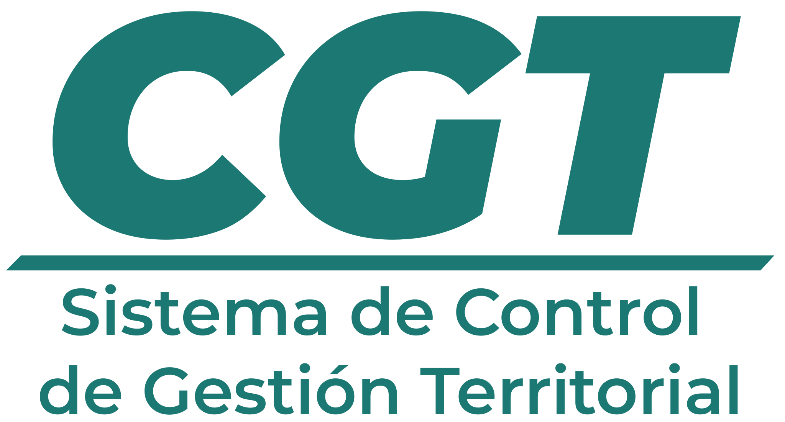

# 🏛️ CGT: Sistema de Control de Gestión Territorial

<div align="center">



**Sistema integral para la gestión y control territorial del Estado Guárico, Venezuela**

[](https://reactjs.org/)
[](https://www.typescriptlang.org/)
[](https://vitejs.dev/)
[](https://www.docker.com/)

</div>

---

## 📋 Descripción

El **Sistema de Control de Gestión Territorial (CGT)** es una plataforma web moderna desarrollada por la **Dirección General de Informática** de la Gobernación del Estado Guárico, Venezuela. Este sistema integral permite la gestión, seguimiento y control de proyectos territoriales, programas gubernamentales y actividades de desarrollo en toda la región.

### 🎯 Objetivos Principales

- **Gestión Territorial**: Control centralizado de proyectos por municipios y parroquias
- **Seguimiento de Proyectos**: Monitoreo en tiempo real del avance de obras y programas
- **Gestión de Recursos**: Control de presupuestos, mano de obra y recursos asignados
- **Reportes y Analytics**: Generación de informes detallados y análisis de datos
- **Geolocalización**: Mapeo interactivo de proyectos con coordenadas UTM

---

## 🚀 Características Principales

### 🗺️ **Gestión Geográfica**
- Mapas interactivos con Leaflet
- Geolocalización precisa de proyectos
- Visualización por municipios y parroquias
- Coordenadas UTM integradas

### 📊 **Gestión de Proyectos**
- Creación y seguimiento de proyectos
- Control de presupuestos y recursos
- Gestión de actividades y metas
- Indicadores de rendimiento (KPIs)

### 👥 **Gestión de Usuarios**
- Sistema de autenticación seguro
- Roles y permisos diferenciados
- Gestión de secretarías territoriales
- Control de dependencias

### 📈 **Reportes y Analytics**
- Generación de PDFs automática
- Gráficos y estadísticas en tiempo real
- Dashboard ejecutivo
- Exportación de datos

### 🏗️ **Gestión de Recursos**
- Control de mano de obra (calificada/no calificada)
- Gestión de presupuestos
- Seguimiento de beneficiarios
- Control de materiales y equipos

---

## 🛠️ Tecnologías Utilizadas

### **Frontend**
- **React 19.1.0** - Biblioteca de interfaz de usuario
- **TypeScript 5.8.3** - Tipado estático
- **Vite 7.0.3** - Herramienta de construcción
- **Styled Components** - Estilos CSS-in-JS
- **React Router** - Enrutamiento de aplicaciones

### **Mapas y Geolocalización**
- **Leaflet** - Biblioteca de mapas interactivos
- **React Leaflet** - Integración con React
- **Geoman.io** - Herramientas de dibujo en mapas
- **UTM** - Conversión de coordenadas

### **Gestión de Estado**
- **Zustand** - Gestión de estado ligera
- **React Query** - Gestión de datos del servidor
- **Formik** - Manejo de formularios

### **UI/UX**
- **Framer Motion** - Animaciones
- **Lucide React** - Iconografía
- **Recharts** - Gráficos y visualizaciones
- **SweetAlert2** - Notificaciones elegantes

### **Utilidades**
- **Axios** - Cliente HTTP
- **Moment.js** - Manejo de fechas
- **React PDF Renderer** - Generación de PDFs

---

## 📦 Instalación y Configuración

### Prerrequisitos
- Node.js (versión 18 o superior)
- npm o yarn
- Docker (opcional, para contenedores)

### Instalación Local

```bash
# Clonar el repositorio
git clone [URL_DEL_REPOSITORIO]
cd cgt

# Instalar dependencias
npm install
# o
yarn install

# Configurar variables de entorno
cp .env.example .env
```

### Variables de Entorno

```env
VITE_ENV=local|develop|production
VITE_APP_ID=your_app_id
```

### Ejecutar en Desarrollo

```bash
# Servidor de desarrollo
npm run dev
# o
yarn dev

# El servidor estará disponible en http://localhost:5173
```

### Construcción para Producción

```bash
# Construir la aplicación
npm run build
# o
yarn build

# Vista previa de la construcción
npm run preview
```

---

## 🐳 Docker

### Desarrollo
```bash
docker-compose -f docker-compose-dev.yml up
```

### Producción
```bash
docker-compose -f docker-compose-prod.yml up
```

### Construir y Publicar Imagen
```bash
# Para Linux/Windows
npm run push:image

# Para macOS
npm run push:image:mac
```

---

## 🏗️ Estructura del Proyecto

```
src/
├── components/          # Componentes reutilizables
│   ├── Forms/          # Formularios del sistema
│   ├── Map/            # Componentes de mapas
│   ├── Navigation/     # Navegación
│   ├── PDFModel/       # Generación de PDFs
│   └── Ui/             # Componentes de UI base
├── pages/              # Páginas principales
│   ├── Home/           # Dashboard principal
│   ├── Management/     # Gestión de proyectos
│   ├── Security/       # Autenticación
│   └── Contacts/       # Gestión de contactos
├── store/              # Gestión de estado (Zustand)
├── hooks/              # Hooks personalizados
├── utils/              # Utilidades y helpers
├── lib/                # Configuración de librerías
└── assets/             # Recursos estáticos
```

---

## 🔐 Autenticación y Seguridad

El sistema utiliza un sistema de autenticación basado en JWT con las siguientes características:

- **Autenticación Centralizada**: Integración con el sistema de autenticación del Gobierno de Guárico
- **Roles y Permisos**: Control granular de acceso por funcionalidad
- **Interceptores**: Manejo automático de tokens expirados
- **Rutas Protegidas**: Acceso controlado a funcionalidades sensibles

### Roles del Sistema
- **Administrador**: Acceso completo al sistema
- **Gestor**: Gestión de proyectos y reportes
- **Usuario**: Consulta y visualización de datos

---

## 📊 Funcionalidades por Módulo

### 🏠 **Dashboard Principal**
- Resumen ejecutivo de proyectos
- Indicadores clave de rendimiento
- Gráficos de avance por territorio
- Alertas y notificaciones

### 📋 **Gestión de Proyectos**
- Creación y edición de proyectos
- Asignación de recursos
- Seguimiento de actividades
- Control de presupuestos

### 🗺️ **Visualización Geográfica**
- Mapas interactivos por municipio
- Geolocalización de proyectos
- Filtros territoriales
- Exportación de coordenadas

### 👥 **Gestión de Contactos**
- Directorio de beneficiarios
- Información de comunidades
- Gestión de ACA (Áreas de Comunidad Autogestionada)

### 📈 **Reportes y Analytics**
- Generación automática de PDFs
- Reportes ejecutivos
- Estadísticas territoriales
- Exportación de datos

---

## 🔄 Flujo de Trabajo

### 1. **Registro de Proyecto**
```
Información Básica → Ubicación → Recursos → Metas
```

### 2. **Seguimiento**
- Actualización de actividades
- Control de presupuestos
- Seguimiento de beneficiarios
- Generación de reportes

### 3. **Evaluación**
- Análisis de indicadores
- Reportes de cumplimiento
- Evaluación de impacto

---

## 🚀 Despliegue

### Entornos Disponibles

| Entorno | URL | Descripción |
|---------|-----|-------------|
| **Local** | `http://localhost:3000` | Desarrollo local |
| **Develop** | `https://demo-api-cgt.guarico.gob.ve` | Ambiente de pruebas |
| **Production** | `https://api-cgt.guarico.gob.ve` | Producción |

### CI/CD Pipeline

El proyecto utiliza GitHub Actions para:
- Construcción automática de imágenes Docker
- Despliegue automático en producción
- Notificaciones a Portainer

---

## 🤝 Contribución

### Estructura de Commits
```
feat: nueva funcionalidad
fix: corrección de errores
docs: documentación
style: cambios de estilo
refactor: refactorización de código
test: pruebas
chore: tareas de mantenimiento
```

### Proceso de Desarrollo
1. Crear rama desde `main`
2. Desarrollar funcionalidad
3. Ejecutar pruebas
4. Crear Pull Request
5. Revisión de código
6. Merge a `main`

---

## 📞 Soporte y Contacto

### Dirección del Proyecto
- **Msc. Ivonne Camacho** - Directora General de Informática
- **Organización**: Dirección General de Informática - Gobernación del Estado Guárico

### Equipo de Desarrollo
- **Salvador Ron** - Frontend & Backend
- **José Segovia** - Frontend & Permisos
- **Erik Zerpa** - Gestión de Metas
- **Jesús Medina** - Backend & ACA

### Información de Contacto
- **Institución**: Dirección General de Informática
- **Dependencia**: Gobernación del Estado Guárico
- **Sitio Web Institucional**: [informaricadgi.guarico.gob.ve](https://informaricadgi.guarico.gob.ve)
- **Sitio Web Gubernamental**: [guarico.gob.ve](https://guarico.gob.ve)
- **Email**: [informaticadgi@guarico.gob.ve](mailto:informaticadgi@guarico.gob.ve)

---

## 📄 Licencia

Este proyecto es propiedad de la **Dirección General de Informática** de la Gobernación del Estado Guárico, Venezuela. Todos los derechos reservados.

---

<div align="center">

**Desarrollado con ❤️ para el Estado Guárico**

*"Por amor a Guárico"*

</div>
